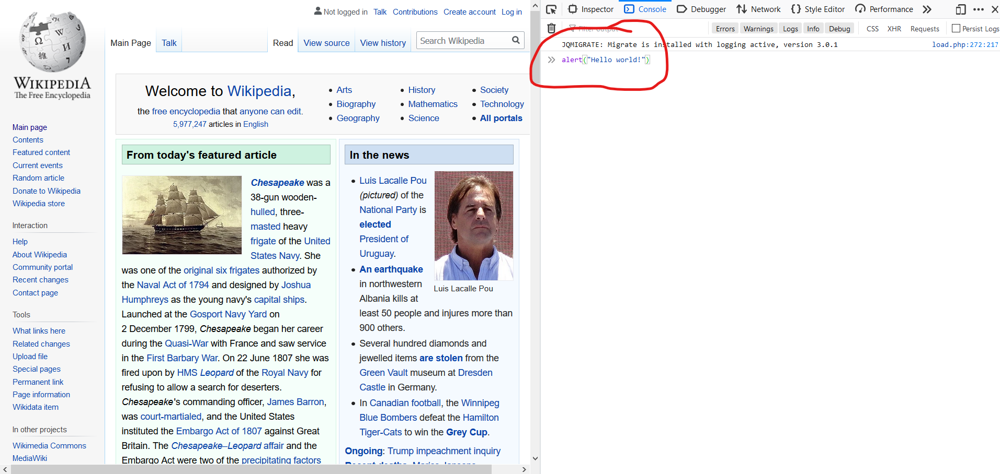
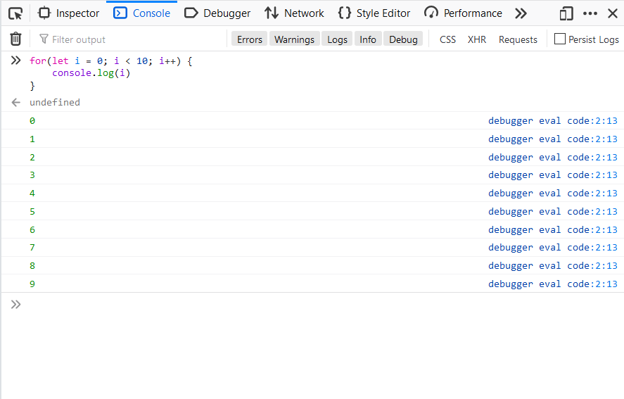

# What is Programming?

Programming lets us control what computers do. This is powerful because computers are good at what humans are bad at, and vice versa.

For example:

- Humans are terrible at dealing with large numbers, while even the weakest computers can calculate huge multiplications in the literal blink of an eye.

- Computers have no creativity: they can't combine different ideas into something new, they just do what they're told. Humans don't like to do what they're told, and they are great at combining different ideas and concepts.

- Humans have a limited memory, computers can store every pixel and sound of 100 movies in something the size of your pinkie. 

Thus, if we can control computers, we can accomplish much more than we can with just our brain.

So how do you do it?

You give it instructions. These instructions are written in something called programming languages. These are just like human languages, but for computers. Each programming language has its own words and grammar, just like our human languages.

There are thousands of programming languages, and they all fill different roles and communicate in different ways to computers. We have programming languages that are good at controlling what computers do in detail, while others give more general instructions.

An example of a programming language is JavaScript. JavaScript is a language that was invented 1995 and is now one of the most used programming languages. It's used for controlling web browsers, such as Chrome or Firefox. Thus, when you go to google.com, or any other website, the computer reads some JavaScript and follows its instructions.

Let's see what it looks like:

```javascript
alert("Hello world!")
```

This is a line of code. It tells it to create an alert with the text "Hello world!". If you have a computer nearby, you can try it by opening a browser, such as Chrome or Firefox, and pressing "CTRL + SHIFT + I" or F12. Then, write the code above into the text field.



A small alert box should appear at the middle of you screen with the text you wrote.

If it works, you should have now written your first line of code!

Let's try some more code:

```javascript
for(let i = 0; i < 10; i++) {
    console.log(i)
}
```

Like last time, copy this code, paste it into the same place as before, and press enter.

You should see this:



It writes out the numbers 0 to 9. It's simple, but it's a start!

Try to play around with the code above. What happens if you change the 0 to something else? What happens if you have two `console.log(i)` after each other?

Here are some tasks to prepare for the lesson next week:

- Can you find the names of three other programming languages? What are they used for?

- If you could program, what are five things that you would build?

- With the code above, we wrote out the numbers 0 to 9. Can you write code to write out the numbers in reverse? This is a hard question, so you'll have to experiment to figure it out. If you get stuck, I'll leave some hints below.

Email the solutions to me at erlend@landroe.com.


**Hints for hard question**

1. `i++` means that the number increases by one each time. `i--` means that the number decreases by one each time.
2. `let i = 0` tells the computer to start counting from 0.
3. `i < 10` says that the computer should count until the number is less than 10.
4. You have to turn so that you start at 9, decrease by one each time, until the number is less than 1.

